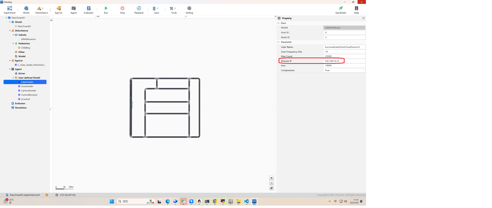
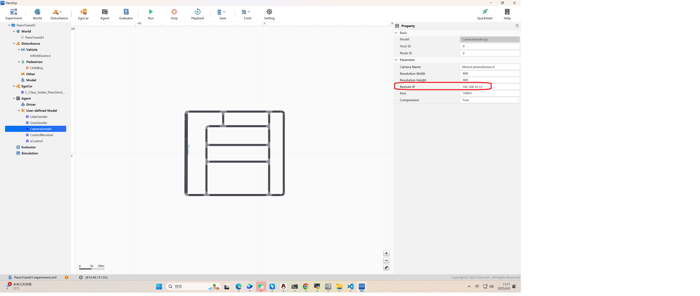
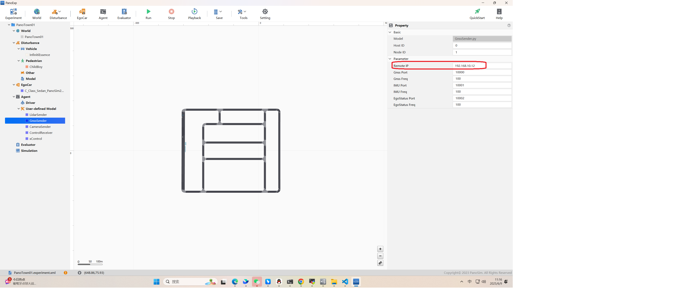
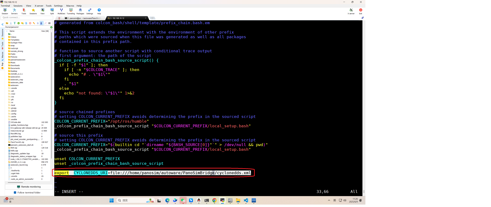
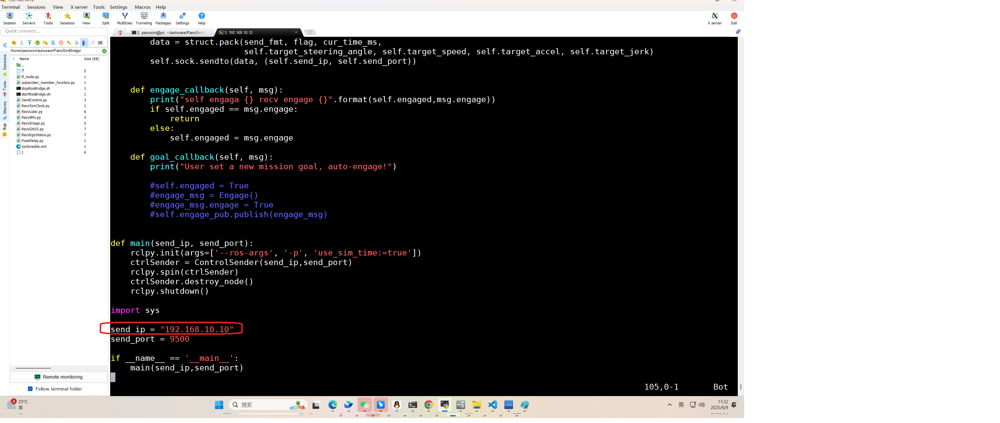
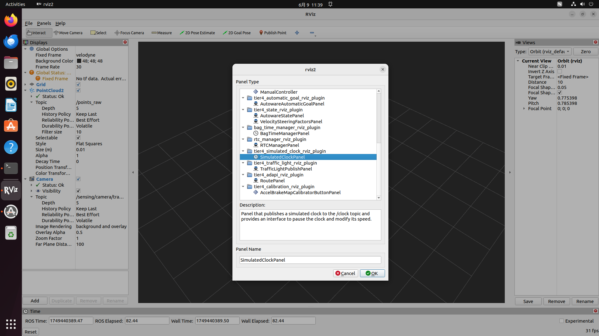

# PanoSim_Autoware_Bridge
# 概述
PanoSim和Autoware联合仿真教程。基于PanoSim V32.9和Autoware.universe版本，包含通讯中间件，地图场景，安装配置。
# 目录结构
1. PanoSim：包含联合仿真中PanoSim端的相关文件
2. Autoware：包含联合仿真中Autoware端的相关文件
# 环境说明
PanoSim和Autoware电脑需要在一个网段，并且互相可以ping通，本例的地址如下
```
PanoSim：192.168.10.10
Autoware: 192.168.10.12
```
# 安装说明
1. 完成PanoSim V32.9 和 Autoware.universe 版本的安装。
2. 将目录PanoSim\PanoSimDatabase 下文件拷贝到PanoSim V32.9的Database下的相同目录
3. 将目录Autoware\install 和 Autoware\PanoSimBridge 目录拷贝到 Autoware的安装目录，一般为/home/${user_name}/autoware/
4. 用PanoExp打开实验PanoTown01并修改LidarSender, GnssSender,CameraSender的地址为autoware电脑的地址，端口若无特殊需求则不用修改
   
   
   
5. 在autoware端，修改autoware相关配置
   修改~/autoware/install/setup.bash 文件 在最后加上CYCLONEDDS_URI=file:///home/panosim/autoware/PanoSimBridge/cyclonedds.xml
   ```
   vim ~/autoware/install/setup.bashexport
   CYCLONEDDS_URI=file:///home/panosim/autoware/PanoSimBridge/cyclonedds.xml
   ```
    

   修改~/autoware/PanoSimBridge/SendControl.py 将其中地址改为PanoSim地址
   ```
   panosim@pc:~/autoware/PanoSimBridge$ cd ~/autoware/PanoSimBridge/
   panosim@pc:~/autoware/PanoSimBridge$ vim SendControl.py
   ```
     
   
# 使用说明
1. 启动autoware rviz
   ```
   source ~/autoware/install/setup.bash
   ros2 launch autoware_launch panosim_simulator.launch.xml map_path:=$HOME/autoware_map/PanoTown01 vehicle_model:=sample_vehicle sensor_model:=sample_sensor_kit  > autoware_launch.log 2>1
   ```
2. 增加SimulatedClockPanel
   
3. 启动PanoSimBridge
   ```
   panosim@pc:~/autoware/PanoSimBridge$ cd ~/autoware/PanoSimBridge/
   panosim@pc:~/autoware/PanoSimBridge$ ./startRosBridge.sh
   ```
4. PanoExp中点击Run,运行实验PanoTown01
